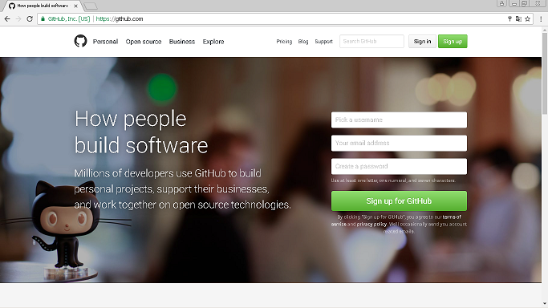
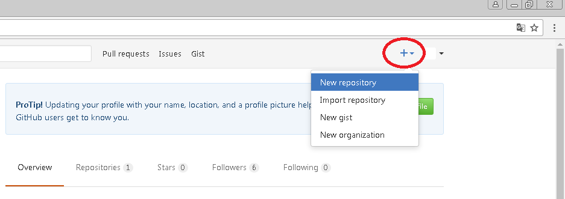
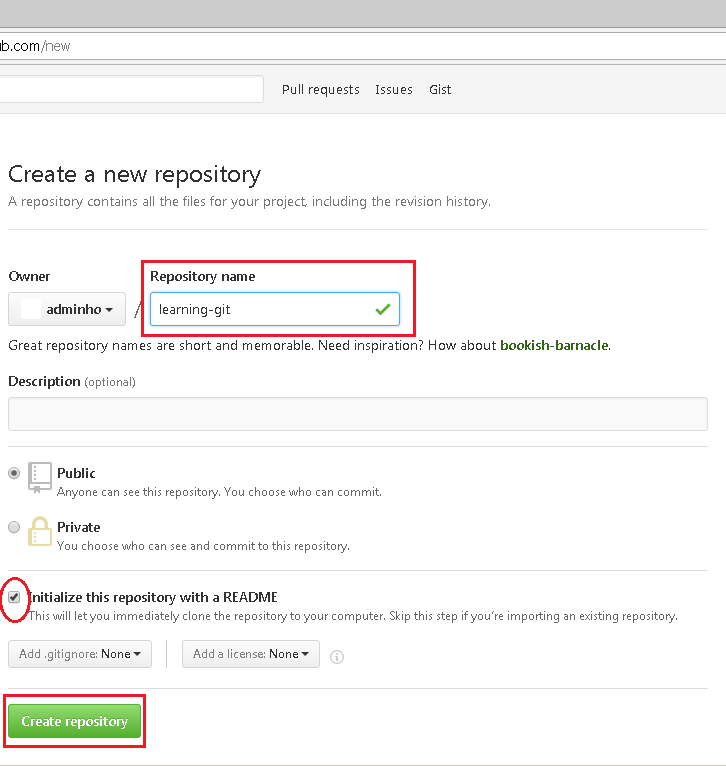

# สวัสดี Git และ GitHub  
# (คู่มือสำหรับโปรแกรมเมอร์เบื้องต้น ไม่รู้ถือว่าเฉยนะขอบอก)
***  __เขียนค้างไว้ไม่เสร็จ ขึ้นอยู่กับอารมณ์และวันว่างๆ__

## เกริ่นนำเรื่อง Git

```
Git อ่านว่า “กิท” ไม่ใช่ กฤษณ์ ที่เป็นดารา แต่เป็น… (เดี่ยวเฉลย)
```

ก่อนอื่นขอเท้าแชร์ให้ฟัง …เฮยๆ ไม่ช่ายแหละ ต้องเท้าความให้ฟัง ถึงท่านที่เป็นโปรแกรมเมอร์ (หรือไม่ได้เป็นก็ไม่เป็นไร แต่ถ้าน่าตาดีถือว่าผ่าน) พี่ๆ เพื่อนๆ ลองนึกถึงเวลาที่เราพัฒนาซอฟต์แวร์เป็นทีม มีโปรแกรมเมอร์ 2-3 คน หรือ 5-10 หรือ 10-100 คน หรือมากกว่านั้น เวลาที่พวกเราต้องยุ่งกับซอร์สโค้ดของโปรเจคเดียวกัน …คิดดูดิยิ่งหลายมือปัญหาก็จะมากความใช่ป่ะ! 

นี้ยังไม่รวมถึงเวลาพวกเราต้องแบ่งเวอร์ชั่นของซอฟต์แวร์ เช่น เวอร์ชั่น release, เวอร์ชั่น fix bugs, เวอร์ชั่นยิบย่อย …โอ้ย!สารพัด แค่นี้ก็ชวนปวดเวลาจัดการโค้ดโปรเจคก้อนเดียวกันใช่ไหมล่ะ?

ด้วยเหตุนี้ Git จึงอุแว้อุแว้! …ถือกำเนิดมาเพื่อแก้ปัญหาข้างต้นครับผม และถ้าใครเคยเขียนวิชา Software engineer มา (วิศวกรรมซอฟต์แวร์) สิ่งนี้มันคือ Version Control นั้นเอง (แปลตรงตัว “ตัวควบคุมเวอร์ชั่น”)

```
สรุป Git ตอบสั้นๆ มันคือ Version Control
```

ใครไม่รู้จักคำว่า Version Control ลองอ่านสองลิงค์นี้ดู

* https://th.wikipedia.org/wiki/การควบคุมการปรับปรุงแก้ไข
* https://git-scm.com/book/th/v1/เริ่มต้นใช้งาน-เกี่ยวกับ-Version-Control

## ทำไมยุคนี้เราควรรู้จัก

จริงถ้าพูดตรงๆ นะ Version Control ถือว่ามีหลายเจ้า ยกตัวอย่างเช่น CVS, Subversion(SVN) แล้วทำไมต้องรู้จักสองตัวที่ว่า เหตุผลคือตอนนี้บริษัทใหญ่ระดับโลกใช้มันเยอะ ดูรูปต่อไปข้างล่าง แล้วจะรู้ว่าพี่บึมเจ้าไอทีเจ้านั้นใช้บ้าง และนี้คือเหตุผลที่พวกเราควร …”รู้ไว้ใช่ว่าใส่บ่าแบกห่าม”


(ที่มารูป https://git-scm.com/)

## ศัพท์พื้นที่ต้องรู้

ถ้าจะอ่านเนื้อหาต้องไปนี้รู้เรื่อง ต้องรู้จักคำๆ นี้ คำว่า “รัก” มันคืออะไร …พิมพ์ผิดๆๆๆ คุณต้องรู้ว่าพวกนี้
1.	Repositories
2.	Branches 
3.	Commits 
4.	Pull Requests

แต่ตอนนี้ขออุ๊บไว้ก่อน จะทยอยแทรกคำอธิบายในหัวถัดไป (ก็เค้าไม่รู้จะอธิบายให้ตัวเองเห็นภาพยังไงนี้น๊า)

## Repository คืออะไร

ถ้าพูดถึง “Repository” แปลว่า "คลังเก็บ, สถานที่เก็บ (ข้อมูลดิจิทัล ฐานข้อมูล) แหล่งที่อยู่ (เว็บไซต์)" โดย สวทช.
ส่วน Repository ในที่นี้มันคือคลังแสง เอาไว้เก็บไฟล์ซอร์โค้ดของเราไงครับ แต่มันไม่ใช่แค่เก็บโค้ดเราอย่างเดียวหรอก เก็บไฟล์ได้ทุกประเภท ตั้งแต่สักเบือยันเรือรบ เช่น โฟลเดอร์, รูปภาพ,วีดีโอ, ไฟล์เสียง, excel, power point, ไฟล์เท็กซ์, ไฟล์ข้อมูล  …พูดง่ายอะไรเป็นไฟล์ของโปรเจคเรา ก็ยัดเก็บไว้ในนี้แหละ

## แล้ว GitHub คืออะไร

เห็นหัวข้อบทความ มันจ่าหัวตัวโตๆ กล่าวถึง Git กับ GitHub และบางคนได้ยินสองคำนี้ควบคู่กัน ยังกับคู่แฝดปลาท่องโก๋ …. แล้ว GitHub มันคืออะไร ?
มันก็คือเว็บกลางที่ให้บริการ Repository โดยเราไม่ต้องต้องหาเครื่องเอาไว้ทำ Repository ให้เสียเวลา 

แน่นอน! ส่วนใหญ่โปรเจคที่เอามาเก็บไว้ที่ GitHub ส่วนใหญ่ก็มักเป็น Open source  เสียด้วยซิ และรูปข้างล่างคือบริษัทระดับโลกที่ Opensource โปรเจคตัวเอง มาไว้ที่นี้ตรึมเลย

![บริษัทที่ใช้ GitHub] https://cdn1.tnwcdn.com/wp-content/blogs.dir/1/files/2016/09/Microsoft-tops-GitHubs-list-of-orgs-with-open-source-contributors.jpg


## การใช้ GitHub เบื้องต้น

### ต้องมีแอคเคาทน์ของเว็บ GitHub
ไปที่เว็บ [GitHub.com]( https://github.com/) เปิดแอคเคาท์น์เสียก่อน ก็จะเห็นตามรูป ซึ่งวิธีสมัครง่ายๆ คงไม่แนะนำอะไรมาก


### สร้าง Repository ขึ้นมา

ตามรูปเมื่อล็อกอินแอคเคาท์เราไปในเข้าเว็บแล้ว ก็น่าจะเห็นมุมขวามือ ให้คลิกเครื่องหมาย “+” ต่อด้วยกด “New repository”


จากนั้นก็จะเห็นหน้าถัดไปทำนองนี้


* ตรง Repository name -> ชื่อของ Repository ตั้งเป็นอะไร ก็ได้ในตัวอย่างตั้งเป็น "learning-git"
* ช่อง Description จะใส่หรือไม่ก็ได้
* แนะนำให้ติ๊กถูก "Initialize this repository with a README"
* หลังจากนั้นก็กด "Create repository"

หลังจากนี้ก็จะถือว่าเสร็จแล้วตามรูปข้างล่าง และในตัวอย่างนี้ผมก็จะได้ URL https://github.com/adminho/learning-git 
เอาไว้ใช้เข้าถึง Repository ที่สร้างขึ้นมานั้นเอง


## อ้างอิง
* https://guides.github.com/activities/hello-world/
* https://help.github.com/categories/writing-on-github/
